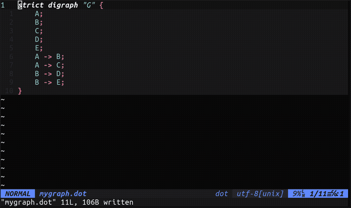

# dgraphack

This is my simple graphical editor for Graphviz DOT files.

It allows you to edit a graph on the rendering exactly as produced by the `dot` tool, and have those changes immediately reflected in the corresponding DOT text file.



Why a graphical editor for DOT files? Because graphs are cool, and DOT files are cool, but it *can be* pretty annoying to edit them with a text editor.

In particular, the non-linear nature of graphs makes it unnatural to textually perform common operations like renaming or deleting nodes with multiple edges attached to them (if there are E edges attached to a node, and you want to rename or delete that node, you have to change E extra lines in a text editor, but in a graphical editor you can just take one action). 

Additionally, it can just be tiring and frictionful to have to look back and forth between a graph rendering and a text editor when making changes, rather than just looking directly at the thing you want to change.

This tool is in early development, so it's probably buggy, missing important features, and lacking in UX friendliness. All comments, criticisms, suggestions, issues, and pull requests are welcome.

So far, the tool has only been verified to work well for fairly simple graphs. If your DOT file is important, you may want to make sure it is backed up or version-controlled before going crazy with this editor.

Right now, the biggest problem with the tool, in my opinion, is that it relies on a hack based around graphviz's HTML cmapx renderings, which is why it has to be a web app for now. My biggest goal is to eventually drop this implementation and have the tool run as a normal native UI application.

## Installation

Currently the best way to install the application is by using pip and a virtual environment.

First create and activate a new virtual env where you want to keep the installation:
```
python3 -m venv venv
source venv/bin/activate
```

Then just install the package from the root of the repo:
```
pip install .
```

The executable will now be located at `venv/bin/dgraphack`.

To make it easier to launch the program without having to activate the env every time, you can create a script similar to below, and place it somewhere on your PATH (for example /usr/local/bin or similar):
```
#!/bin/sh
/path/to/venv/bin/dgraphack $@
```

If you named that script "dgraphack" and made it executable (for example using `chmod +x dgraphack`), you can now run the program by just running `dgraphack` from anywhere.

## Usage

### Running the Tool

The tool runs as a webapp. First launch the API:
```
dgraphack api
```

To avoid doing this manually every time, you can launch this in a startup script (such as ~/.xinitrc on an X11 system), with a line such as `exec dgraphack api &`.

Once the API is running, just launch the editor and give it a graph file:
```
dgraphack edit mygraph.dot
```

This command will open a browser and automatically connect to the API at localhost. It chooses a browser based on the `BROWSER` environment variable, or by using the optional `--browser` argument and giving it [one of the browser type names in the table given here.](https://docs.python.org/3/library/webbrowser.html#webbrowser.get)
To stop a new browser window from blocking the shell, you can run this command in the background, for example by appending `& disown`.

The most seamless way to use the editor is probably to launch it from within a text editor. To do this from Vim, for example, you can set up a keybinding by using lines like these in your ~/.vimrc:
```
augroup gv
  autocmd BufNewFile,BufRead *.gv,*.dot
  \ :noremap <leader>ge <esc>:silent !dgraphack edit % --browser=firefox &<cr>
augroup END
```

### Using the UI

- Click a node to select it
- Click it again to un-select it
- When a node is selected, click another node to connect them with an edge
- Click an edge to delete it
- When a node is selected, you can delete it or edit it with the forms on the right
- Editing a node currently uses JSON format. For example:
  ```
  {
      "label": "My Node",
      "shape": "rectangle"
  }
  ```
- You can freely edit the graph in your text editor, and then refresh the dgraphack editor page to see those
  changes reflected immediately.

